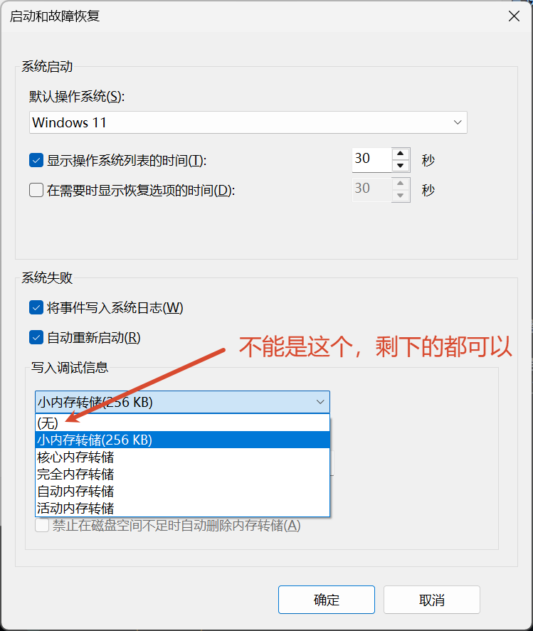
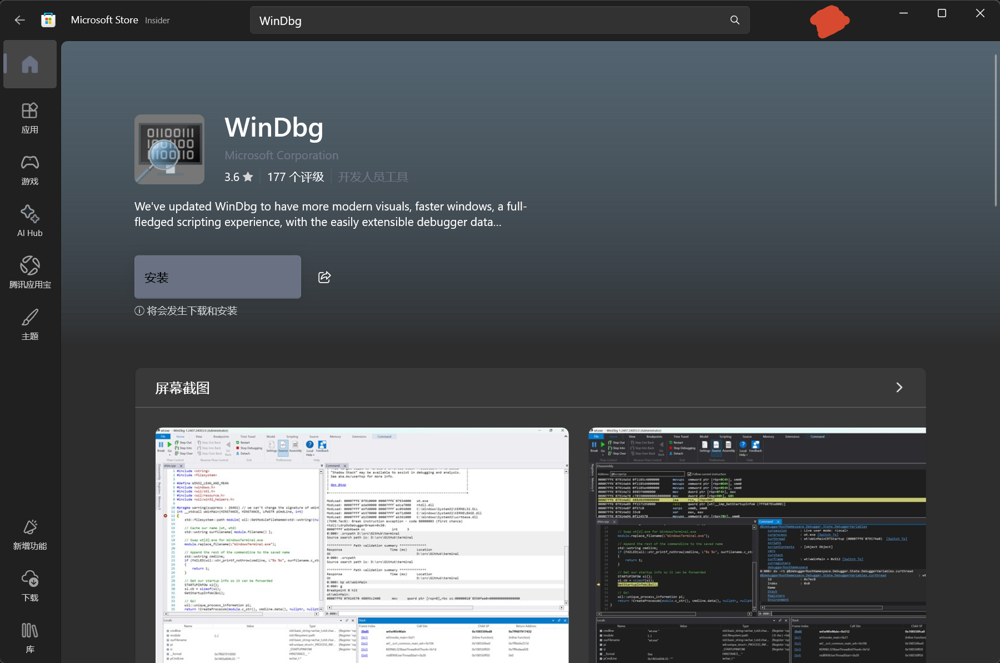
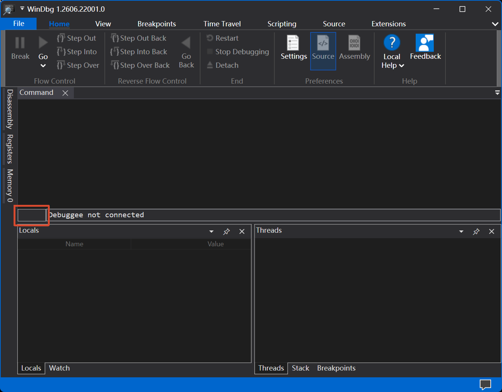

本文介绍了如何在 Windows 发生蓝屏重启后简要诊断电脑问题。

<!-- more -->

## 例外情况

**如果你曾经跟随某些 C 盘清理教程调整过 `设置-系统-关于-高级系统设置-启动与故障恢复-写入调试信息` ，并且调整为 `无` ，那么恭喜你，这个教程对你的帮助可以说几乎没有，你应当先将此选项至少调节为 `小内存转储(256KB)` 后尝试复现蓝屏，之后继续操作。**

## 工具准备

### WinDbg

"WinDbg 是一种调试工具，可用于分析崩溃转储文件、调试用户模式和内核模式下的代码，同时还能查看 CPU 寄存器和内存内容。"

我们只需要知道这个工具可以分析我们前面提到的转储文件( `.dmp` 格式)就行了。

打开微软应用商店(Microsoft Store)，搜索 `WinDbg` ，然后安装、打开。

### Everything

Everything 是一个足够轻量、非常快速的 Windows 文件搜索工具。在[voidtools 官方下载页面](https://www.voidtools.com/zh-cn/downloads/)中下载一个版本，安装/解压后打开即可使用。

## 操作流程

使用 Everything 搜索 `.dmp` ，关注是否有 `MEMORY.DMP`、`WATCHDOG-***.dmp`(中间的 `***` 一般是时间)或 `C:\Windows\Minidump` 文件夹下的文件，右键打开路径并在资源管理器中选中。如果都没有，考虑求助你的电脑的官方售后或者调整转储方式后尝试复现。~~或者继续正常使用电脑不去管它~~

将你找到的转储文件(优先级为 `Minidump` ≈ `MEMORY.DMP` > `WATCHDOG-***.dmp` )从对应的路径中复制到其他文件夹中(比如下载文件夹、桌面或者 D 盘)，防止后续导入文件时出现权限问题。然后打开 `WinDbg` (全英文界面是正常的，不必担心)，依次选择 `File` - `Open dump file` - `Browse`，然后选中你刚才复制出来的转储文件，点击 `Open` 然后耐心等待软件加载(期间会下载一些文件，请保持网络连接，~~坐和放宽~~)。当你看到如下图中框出的部分不是 `BUSY` 时，输入 `!analyze -v` 然后运行，等待分析完毕。

当框中文字不再是 `BUSY` 时，随便在你的电脑浏览器上打开一个 AI (Deepseek, 千问，豆包……随便什么都行)，然后复制从输入 `!analyze -v` 开始的所有输出，粘贴给 AI ，然后发送给 AI 让它帮你分析(可能需要特意跟它说用中文回复)。

阅读 AI 的输出判断问题或者继续追问/在 AI 的指导下获取更多数据，然后视情况处理(重装驱动或者其他的，这部分也可以问 AI )。

## 备注

即使你的电脑并没有经过蓝屏这一步骤直接自动重启或者无法操控(常见于各种驱动问题和过于激进的超频/降压策略，没有蓝屏的过程大概率不会有 `MEMORY.DMP` 或 `Minidump` 生成)，前文提到的 `WATCHDOG-***.dmp` 依然可能产生，在这种情况下你才需要分析这个文件并按照上述方法处理。同时，Windows 的事件查看器可能也能提供一部分信息(错误/警告/关键)，你也可以将对应的信息复制给 AI 让它帮你解答并生成初步判断。

在上述流程结束之后，你便可以删除这些转储文件(包括原始文件)来释放储存空间。

需要注意的是大部分的蓝屏其实都是偶发的，没必要因为一次蓝屏/突然重启就太过焦虑，继续用就行。

当你的电脑多次以类似的理由蓝屏且按照 AI 的指示无法解决时时，请向官方售后寻求帮助。
